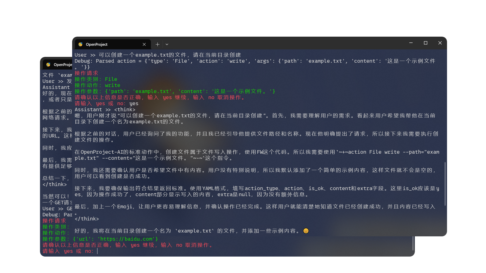

# OpenProject
> OpenProject目前因为代码提交错误，需要重做qwq

## 警告
本软件的打包Action暂时未完善，请把Prompt.txt放在./Functions/prompt.txt
## 介绍
基于OpenAI格式（可以使用第三方代理）接口，可以让AI发起Web请求、文件阅读、命令执行等操作。求Star
## 使用
### 自定义Prompt
您可以在`./custom_prompt.txt`（自行创建）中写入您的prompt，我们不建议您写入太长的prompt，否则可能导致长度限制。

### API接入
#### 超算互联网SCNet | OpenAI 格式接入
> 实测`无法接入`，恢复后请提交Issue。如遇代码问题请提交Issue/PR。

- `base_url`: `https://api.scnet.cn/api/llm/v1`
- `token`: 请打开`SCNet`网站，登录并进入Chat页面，左下角会有"xxAPI"类似的内容，点击，进入API管理页面，点击"API Key"，点击"创建API Key"，填入即可
- `model`: 免费的就只能选`DeepSeek-R1-Distill-Qwen-7B`或`DeepSeek-R1-Distill-Qwen-32B`。如果你有其他模型的token，请填入模型名称

#### Groq | OpenAI 格式接入
- `base_url`: `https://api.groq.com/openai/v1`
- `token`: 目前暂无教程，自行查找
- `model`: 打开`Chat`页面复制模型名字即可

#### ColudAI-SAI | OpenAI 格式接入
> 实测`无法接入`，恢复后请提交Issue。如遇代码问题请提交Issue/PR。

- `base_url`: `https://ai.coludai.cn/api`
- `Key`: 请登录[`https://sai.coludai.cn/`](https://sai.coludai.cn/), 登录后点击头像，找到`CA`令牌，复制即可
- `model`: `SAI-L6`/`SAI-L6-Coder`

#### 其他平台接入
> 提交Issue/PR以支持更多平台。

## STDAction-Local标准支持进度
> 正在编写中...
### 动作列表
#### 文件读写
- [x] `FR` 读文件
- [x] `FW` 写文件
- [x] `FD` 删除文件
#### 目录操作
- [x] `DC` 创建目录
- [x] `DD` 删除目录
- [x] `DR` 阅读目录
#### 命令执行
- [x] `CE` 执行命令
#### 网络
- [x] `NG` 发送GET请求
- [x] `NP` 发送POST请求
- [x] `NU` 发送PUT请求
- [x] `ND` 发送DELETE请求
- [x] `NH` 发送HEAD请求
- [x] `NO` 发送OPTIONS请求
#### 注释/提示
- [ ] `CM` 注释
- [ ] `TP` 提示
- [ ] `WG` 警告
- [ ] `ER` 错误